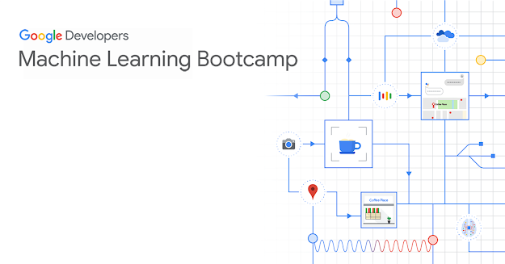
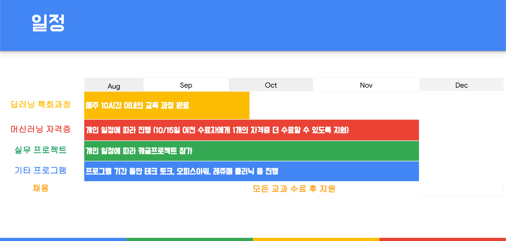

# Google-ML-Bootcamp-2021-Kor

> In this repository, I recorded everything that experienced when I participated in the Google Developers Machine Learning Bootcamp 2021 Korea. From 21.08.12.Thu
 

## Overview
### what is Google-ML-Bootcamp?
> Google-ML-Bootcamp-2021 is program that provides machine learning education to developer so that they can grow as machine learning engineer
### How is the program?
> Google-ML-Bootcamp-2021 consistents of four parts

| Part | Goal | Start | End | etc | 
| :--- | :---: | :---: | :---: | :---: |
| Part1. Coursera Deep Learning Specialization Courses | `Deep Learning Specialization Certification` | 21.08.08.Sun | # | # | # |
| Part2. Machine Learning Certifications | `TensorFlow certification` | # | # | # | 
| Part3. Machine Learning Project | `Kaggle Tabular playground`, `competition` | # | # | # | 
| Part4. Machine Learning Networking | `Tech Talk`, `Career,` `Growth`, `Mentoring` | # | # | # | 

### Timeline

 

## 1. Deep Learning Specialization Course
## 2. TensorFlow Certification
## 3. Kaggle Competition
## 4. (Optional) GCP Professional Data Engineer certification 
## Networking
### N1. Tech Talk
### N2. Career Session
### N3. Mentoring
### N4. Community
